# RTL to GLS Workshop – Week 1

This repository documents the synthesis, optimization, and gate-level simulation (GLS) flow using **Yosys**, **Icarus Verilog**, and **GTKWave** with the Sky130 standard cell library.  

---

## 1. Tool Commands and Their Purpose

### 1.1 Yosys Commands
Yosys is an open-source synthesis tool that converts RTL Verilog into a gate-level netlist using technology cells.

| Command | Purpose |
| ------- | ------- |
| `read_liberty -lib <path_to_lib.lib>` | Loads the technology library. The `.lib` file contains timing, functionality, and power details of standard cells. This step ensures Yosys knows what gates and flip-flops are available for mapping. |
| `read_verilog <file.v>` | Loads the RTL Verilog design into Yosys for synthesis. |
| `synth -top <module>` | Runs generic synthesis starting from the specified top-level module. This produces an intermediate representation with generic flip-flops and logic gates. |
| `flatten` | Flattens module hierarchy, merging all submodules into a single level. Useful for optimization and global mapping. |
| `dfflibmap -liberty <path_to_lib.lib>` | Maps generic flip-flops (`$dff`) to actual flip-flops from the target library. |
| `abc -liberty <path_to_lib.lib>` | Performs technology mapping and logic optimization using the ABC tool, replacing generic logic with real standard cells. |
| `opt_clean -purge` | Cleans up the design by removing unused nets, redundant gates, and dangling logic. Equivalent to a garbage collector. |
| `clean` | Removes any remaining unused wires and cells after mapping. |
| `write_verilog -noattr <output.v>` | Writes out the final synthesized netlist in Verilog format. `-noattr` omits synthesis attributes. |
| `show -format png -prefix <name>` | Generates a schematic of the synthesized netlist for visualization. |

---

### 1.2 Icarus Verilog Commands
Icarus Verilog is a simulator for running both RTL and GLS simulations.

| Command | Purpose |
| ------- | ------- |
| `iverilog <files>` | Compiles the specified Verilog files into an executable simulation model (`a.out` by default). Include RTL/GLS design, testbench, primitives, and cell models as needed. |
| `./a.out` | Executes the compiled simulation and produces output files such as `dump.vcd` for waveform analysis. |

---

### 1.3 GTKWave Commands
GTKWave is a waveform viewer used to visualize signals from simulation.

| Command | Purpose |
| ------- | ------- |
| `gtkwave <dump.vcd>` | Opens the VCD (Value Change Dump) file generated by simulation, allowing inspection of RTL and GLS waveforms. |

---

## 2. Task Documentation

Each task includes the flow, results, and corresponding screenshots for Yosys synthesis, Icarus Verilog simulation, and GTKWave waveform verification.

---

### Task 1 – Yosys Optimization with `opt_clean -purge`

**Objective:**  
Explore how Yosys removes redundant wires, unused cells, and dead logic, leaving behind a simplified and efficient netlist.  

**Details:**  
- In `opt_check4.v`, redundant wires are swept away, producing a minimal circuit.  
- In `multiple_module_opt.v`, intermediate unused connections across modules are eliminated, resulting in a smaller and cleaner design.  
- Yosys essentially acts like a “logic garbage collector,” pruning unnecessary logic while preserving functional behavior.  

**Screenshots:**  

Yosys schematic:  
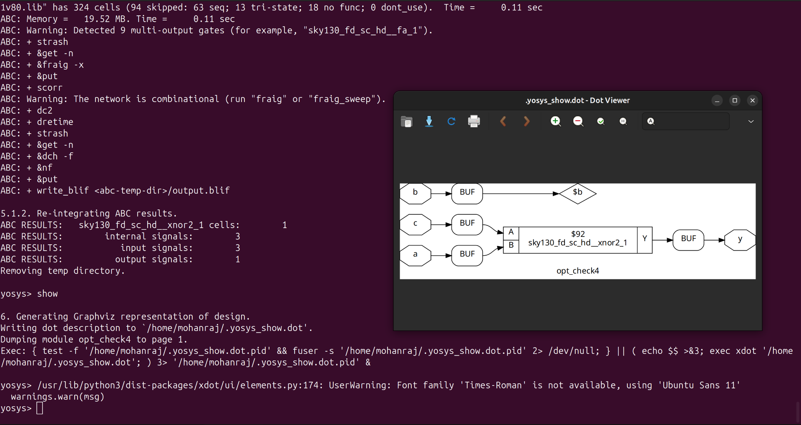

---

### Task 2 – Constant DFF Mapping & GLS

**Objective:**  
Understand how Yosys synthesizes flip-flops when their inputs are tied to constants, and validate this behavior using GLS.  

**Details:**  
- In `const4.v`, outputs are tied to constant logic values (`0` or `1`).  
  - Yosys propagates these constants and removes redundant logic.  
  - Constant buffers are added to distribute fixed values throughout the design.  
- In `const5.v`, additional reset logic is introduced:  
  - Since reset modifies flop behavior, Yosys preserves the flops.  
  - This ensures correctness during asynchronous/synchronous reset conditions.  
- **Gate-level simulation (GLS)** verifies:  
  - Constant-driven signals stay flat (always `0` or `1`).  
  - Reset logic works identically at RTL and GLS levels.  

**Screenshots:**  

Yosys schematic with constants:  
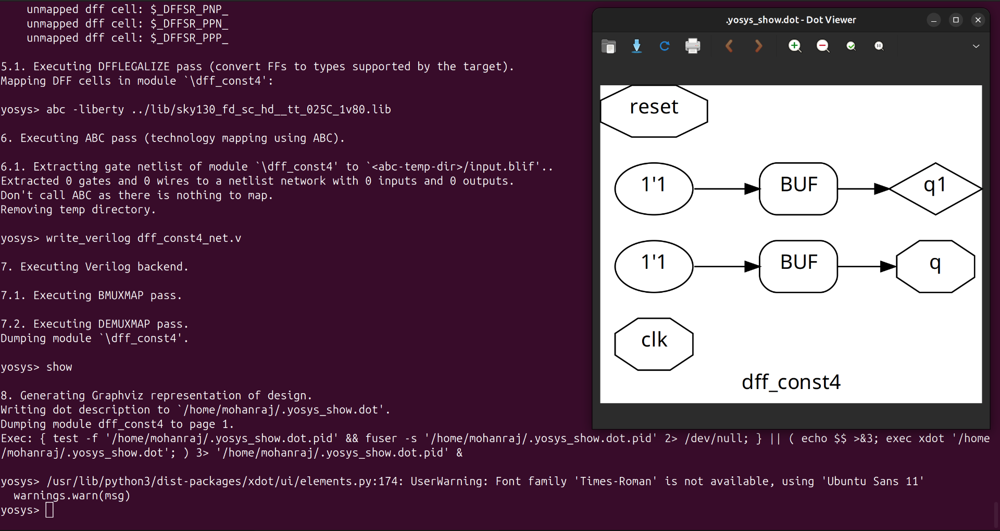

Icarus Verilog simulation log:  
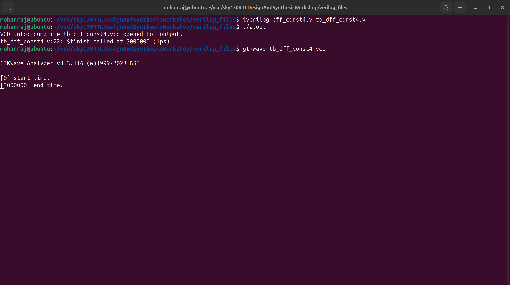

GTKWave waveform (flat constant signals):  
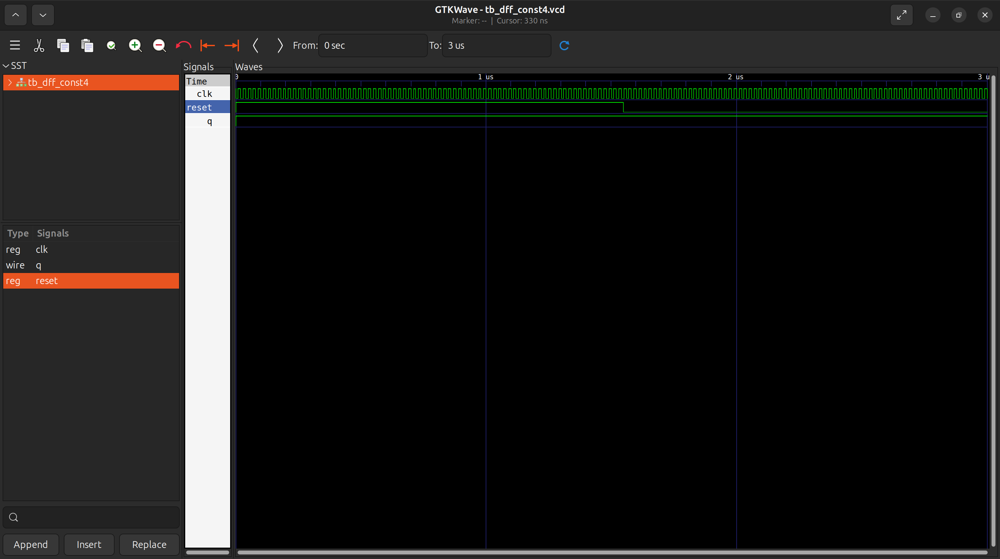

---

### Task 3 – MUX Using `for-generate`

**Objective:**  
Design and synthesize a scalable MUX using `for-generate` loops to reduce manual instantiation and improve reusability.  

**Details:**  
- A `for-generate` block replicates multiplexers based on parameterized inputs.  
- Yosys unrolls the generate loop into actual logic gates.  
- During synthesis, a **latch-mapping issue** was encountered:  
  - Initially, Yosys didn’t map a latch correctly to the Sky130 library.  
  - Fix: provided the correct latch primitive from the Sky130 library.  
- GLS results matched RTL behavior, proving functional equivalence.  
- This demonstrates how **generate loops** automate hardware replication cleanly.  

**Screenshots:**  

Yosys schematic:  
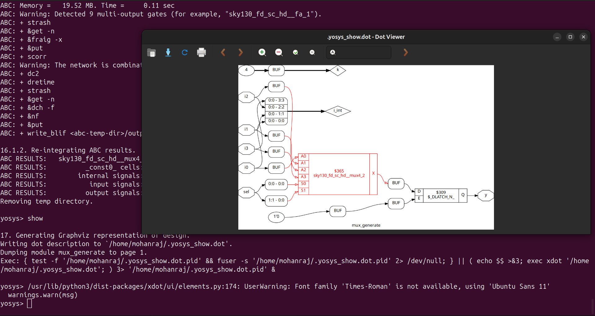

Icarus Verilog simulation:  
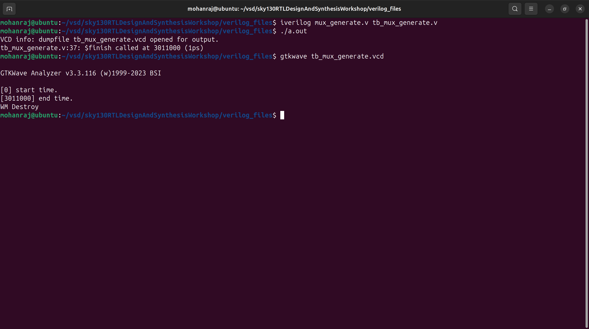

GTKWave waveform:  
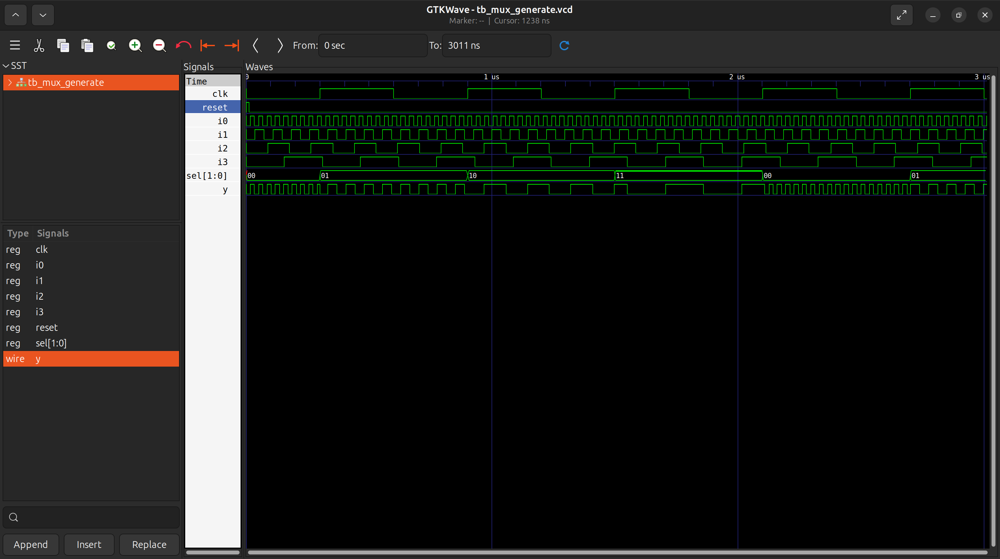

---

### Task 4 – DEMUX Using `generate`

**Objective:**  
Implement and synthesize a DEMUX using `generate` statements and confirm equivalence between RTL and GLS.  

**Details:**  
- The DEMUX design uses generate blocks to expand the required number of outputs.  
- Yosys synthesis expands the block into multiple AND gates with proper enable logic.  
- GLS required **including Sky130 cell models** and primitives during compilation.  
- Both RTL and GLS outputs matched bit-for-bit, proving synthesis correctness.  
- GTKWave waveforms verified that only the selected output line toggles while others stay low.  

**Screenshots:**  

Yosys schematic:  
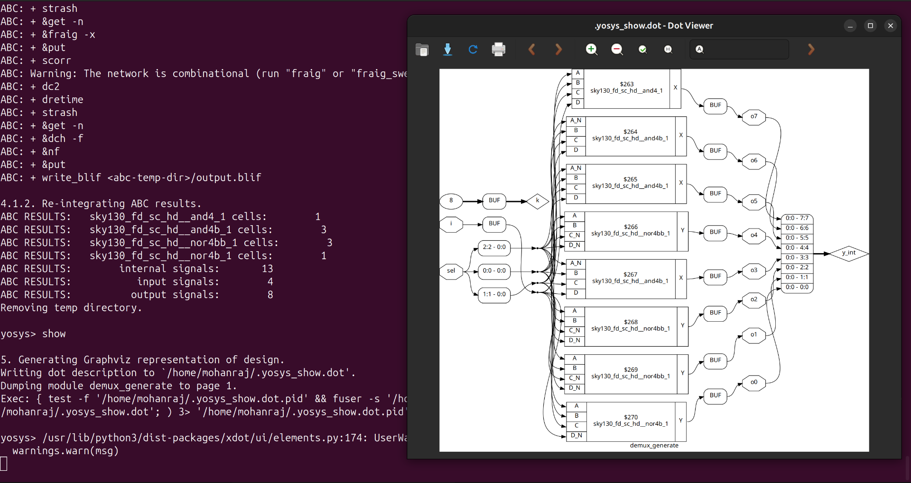

Icarus Verilog simulation:  
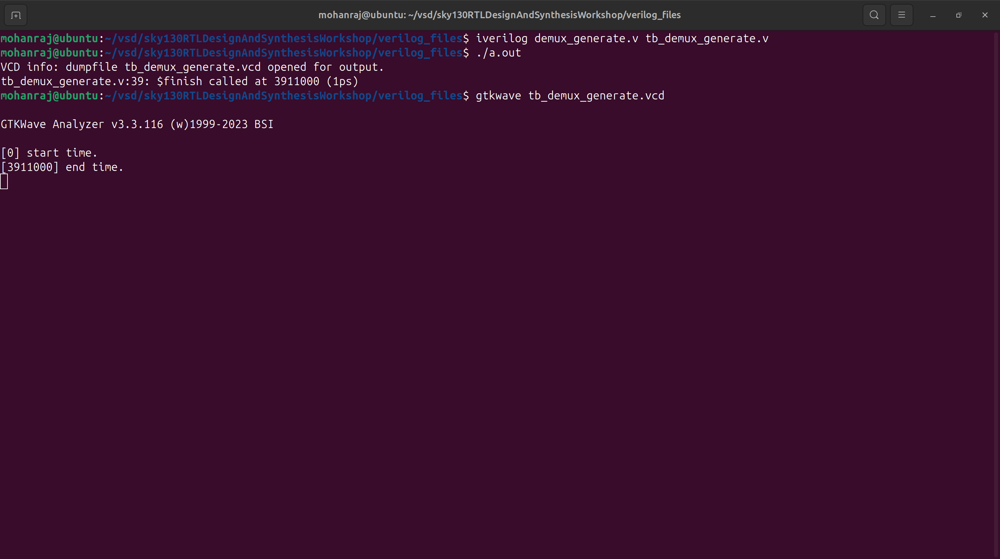

GTKWave waveform:  

---

### Task 5 – Ripple Carry Adder (RCA)

**Objective:**  
Synthesize and simulate a Ripple Carry Adder (RCA) and confirm functionality at both RTL and GLS levels.  

**Details:**  
- The RCA is composed of chained **full adders**, with carry out from one stage feeding carry in of the next.  
- Yosys maps the RCA into Sky130 standard-cell **XOR, AND, and OR gates** implementing full adder logic.  
- GLS confirms correct arithmetic behavior:  
  - Proper propagation of carries.  
  - Sum outputs identical to RTL.  
- GTKWave visualization shows carry rippling through stages, which helps understand the delay characteristics of RCAs.  

**Screenshots:**  

Yosys schematic:  
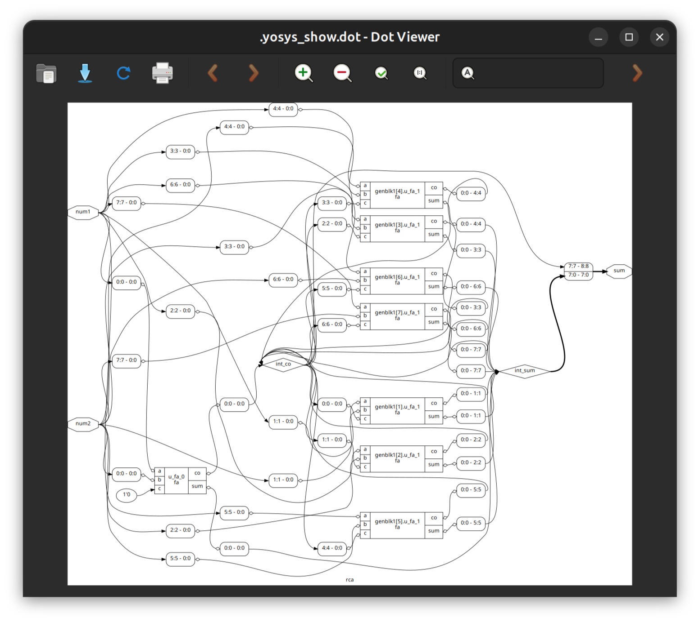

Icarus Verilog simulation:  
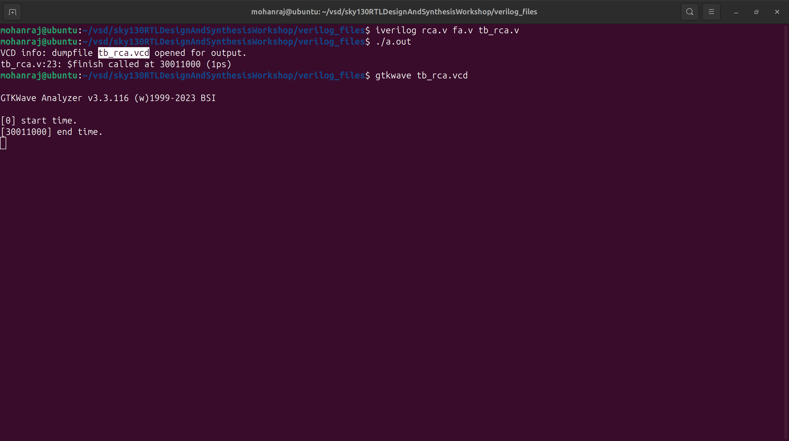

GTKWave waveform:  
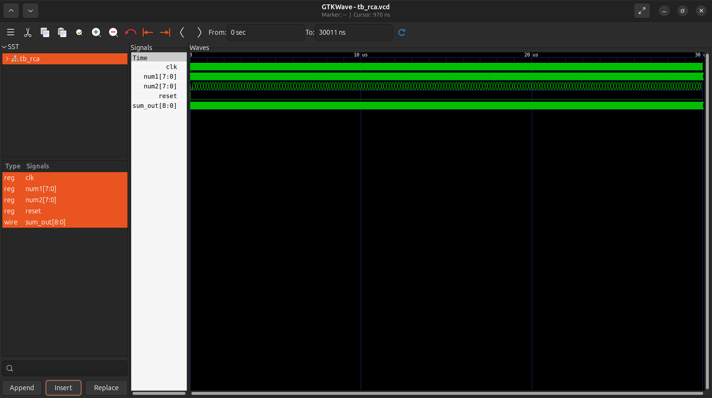

---

## 3. Key Takeaways

- **Yosys** optimizations (`abc`, `opt_clean -purge`) simplify and shrink designs effectively.  
- **Constant propagation**, **generate blocks**, and **arithmetic circuits** are correctly synthesized and verified.  
- **Icarus Verilog GLS** simulation guarantees equivalence between RTL intent and gate-level implementation.  
- **GTKWave** waveforms provide visual confirmation that logic simplifications don’t change functional behavior.  

---
